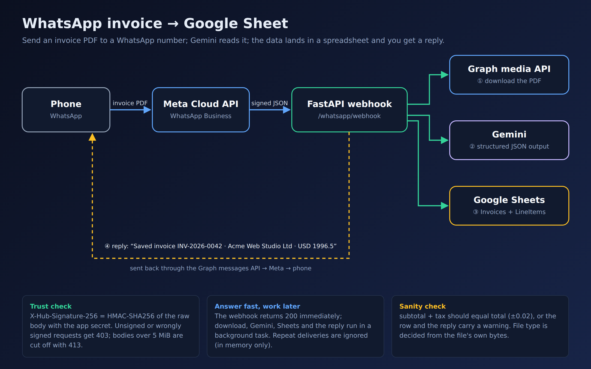
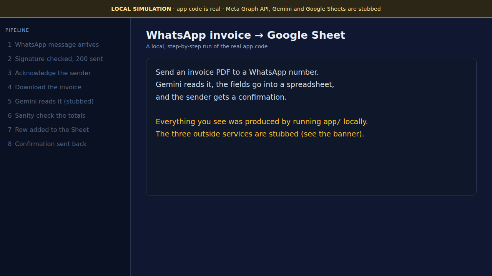

# ai-invoice-update

Prototype: send an invoice PDF to a WhatsApp number, Gemini reads it, and the data lands in a Google Sheet.

```
Phone (WhatsApp) --PDF--> Meta WhatsApp Cloud API --webhook (JSON)--> FastAPI (/whatsapp/webhook)
                                                                        1. check the X-Hub-Signature-256 signature, answer 200 at once
                                                                        2. background: download PDF from Meta -> Gemini -> Google Sheet
                                                                        3. WhatsApp reply: "✅ Saved invoice INV-2026-0042 · Acme Web Studio Ltd · USD 1996.5"
```

It extracts: invoice number, invoice date, due date, supplier name and tax ID, customer name, currency,
subtotal, tax, total and every line item. Anything not printed on the invoice is left blank (Gemini is told never to guess).
If `subtotal + tax` does not equal `total`, the row gets a warning and the WhatsApp reply says so.

## How it looks





*The GIF is a local simulation, not a live run: Meta's servers, Gemini and Google Sheets are replaced by stand-ins (the
Gemini call itself is replaced by fixed values). More images, and what each one is, in
[docs/portfolio](docs/portfolio/README.md).*

## Setup

You need three free accounts. Keep secrets in `.env` (git-ignored); never commit them.
Meta renames dashboard menus fairly often, so follow the wording on screen if it differs slightly from below.

1. **Gemini key**: create one at <https://aistudio.google.com/apikey> and put it in `GEMINI_API_KEY`.
2. **Google Sheet**
   - In Google Cloud, create a project, enable the *Google Sheets API*, and create a *service account*.
     Download its JSON key as `service_account.json` in the repo root.
   - Create an empty Google Sheet and share it (Editor) with the service account's email address (`client_email` in the JSON).
   - Put the ID from the sheet URL (`docs.google.com/spreadsheets/d/<ID>/edit`) in `GOOGLE_SHEET_ID`.
   - The `Invoices` and `LineItems` tabs and their headers are created automatically.
3. **WhatsApp Cloud API (Meta)**: free for testing, no payment method or business verification needed.
   1. Go to <https://developers.facebook.com/apps>, click *Create app*, and choose the use case
      *Connect with customers through WhatsApp* (create or pick a business portfolio when asked).
   2. Open *WhatsApp > API Setup*. Meta has created a free **test phone number** for you; its number is shown there.
   3. Under *To*, open *Manage phone number list* and add **your own phone** (WhatsApp sends you a confirmation code).
      The test number can only message phones on this list (up to 5), and the phone you send invoices from must be on it.
   4. Click *Generate access token* and put it in `WHATSAPP_ACCESS_TOKEN`. This temporary token lasts about 24 hours;
      when replies start failing with error 190, generate a new one, paste it into `.env`, and **restart the app**
      (settings are read once at startup).
   5. Open *App settings > Basic*, click *Show* next to *App secret*, and put it in `META_APP_SECRET`.
   6. Invent any string for `WHATSAPP_VERIFY_TOKEN` (you will type the same string into Meta in a moment).

Then run it:

```bash
python -m venv .venv && source .venv/bin/activate
pip install -r requirements-dev.txt
cp .env.example .env            # fill in the values above
uvicorn app.main:app --port 8000
ngrok http 8000                 # in another terminal; needs a free ngrok account and authtoken
```

Keep the app running, then connect Meta to it:

1. In the Meta dashboard open *WhatsApp > Configuration > Webhook* and click *Edit*.
2. **Callback URL**: `https://<your-ngrok-url>/whatsapp/webhook`. **Verify token**: the string from `WHATSAPP_VERIFY_TOKEN`.
   Click *Verify and save*. Meta calls your app once to check the token; it must be running and reachable over public HTTPS.
3. Under *Webhook fields* click *Manage* and **subscribe to `messages`**. Nothing arrives until you do this.

Now send `samples/sample_invoice.pdf` from your phone to the test number. A row should appear in the sheet
and you should get a "Saved invoice" reply.

If no webhook calls ever arrive, also subscribe your app to the test WhatsApp Business Account (the ID is on the
API Setup page); this may be needed on some accounts:

```bash
export WHATSAPP_ACCESS_TOKEN=...   # same value as in .env
curl -X POST "https://graph.facebook.com/v26.0/<WABA_ID>/subscribed_apps" -H "Authorization: Bearer $WHATSAPP_ACCESS_TOKEN"
```

The free ngrok URL changes every time you restart ngrok; when it does, edit the callback URL in Meta again.

## Try it without WhatsApp

```bash
python scripts/make_sample_invoice.py                  # (re)creates samples/sample_invoice.pdf
python -m app.cli samples/sample_invoice.pdf           # Gemini only, prints JSON
python -m app.cli samples/sample_invoice.pdf --sheet   # also appends to the Google Sheet
pytest -q                                              # offline tests, no keys needed
```

To poke the running webhook by hand you have to sign the body the way Meta does, using your app secret:

```bash
export META_APP_SECRET=...   # same value as in .env
BODY='{"object":"whatsapp_business_account","entry":[]}'
SIG=$(printf '%s' "$BODY" | openssl dgst -sha256 -hmac "$META_APP_SECRET" | sed 's/^.* //')
curl -i -X POST localhost:8000/whatsapp/webhook -H "Content-Type: application/json" -H "X-Hub-Signature-256: sha256=$SIG" -d "$BODY"
curl -i "localhost:8000/whatsapp/webhook?hub.mode=subscribe&hub.verify_token=<your token>&hub.challenge=123"   # prints 123
```

The sample invoice is INV-2026-0042 from Acme Web Studio Ltd to Globex Corporation, total USD 1,996.50.

## Sheet layout

`Invoices`: Received At, From, Invoice Number, Invoice Date, Due Date, Supplier, Supplier Tax ID, Customer,
Currency, Subtotal, Tax, Total, # Line Items, Warnings.
`LineItems`: Invoice Number, Description, Quantity, Unit Price, Amount.

To change what is extracted, edit the fields in `app/models.py` and the header/row lists in `app/sheets.py`.
The Gemini model is set by `GEMINI_MODEL` (default `gemini-3.6-flash`), the Graph API version by `GRAPH_API_VERSION` (default `v26.0`).

## Code map

- `app/main.py`: webhook (verification handshake and messages), duplicate filtering, background processing, WhatsApp replies
- `app/whatsapp.py`: Cloud API client: signature check, two-step media download, sending text
- `app/extractor.py`: Gemini call with a Pydantic schema, so the answer is always validated JSON; file-type sniffing
- `app/sheets.py`: Google Sheets writer (values are written RAW so invoice text can never run as a formula)
- `app/models.py`: the invoice fields and the total sanity check

## Prototype limits

- The test number can only message the (up to 5) phones you added to its list, and replies only work within 24 hours of the
  sender's last message, which is always the case here because the bot answers right away.
- The temporary access token expires after about 24 hours. A permanent one comes from a System User in Meta Business Settings;
  I could not confirm that works with the auto-created test account, so regenerate the temporary one if in doubt.
- One attachment per message; PDF, JPG, PNG and WebP; max 15 MB. The file type is checked from the file's own bytes.
- Background work and the duplicate filter are in-process: if the server restarts mid-job, that invoice is lost and Meta's
  retry of the same message could be processed twice (a real version would use a queue and a database).
- No duplicate-invoice detection: sending the same invoice twice adds two rows.
- Meta announced that replies inside the 24-hour window become billable per message after a monthly free allowance
  from 2026-10-01. I could not confirm whether that applies to test numbers.
- Going beyond the test number needs a real business phone number and Meta business verification.
- The Gemini call is only tested against a fake client (it checks how the app calls Gemini: file, prompt, schema, model),
  never against the real service, so extraction quality on real invoices is unknown until you try it.
- Written from Meta's documentation as summarised by secondary sources; Meta's own pages could not be opened while
  building this, and it has not yet been run against a live Meta account. Treat the first live run as the real test.
